# 12/22 1日目

## 問題概要

- 手札にカードがN枚あり、実行中のプロジェクトがM種類ある
	- カードは5種類ある
		- プロジェクトを進める労働カード2種類
		- プロジェクトをキャンセルして入れ替えるキャンセルカード2種類
		- プロジェクトと手札を強くする増資カード1種類
	- プロジェクトは残務量と価値を持つ
- 以下の操作をTターン行う
	- 手札を1枚使ってプロジェクトに変化を起こす
	- 新しいカードをK枚の中から1枚購入して手札に加える。
		- 1つは無料の通常労働カードであり、性能が一定
	- プロジェクトがM枚に満たなくなった分、ランダムにプロジェクトを補充する

## コーディング前の第一感めも

- すげー機械学習ゲーじゃね？
  - ちゃんと確率分布考えて解いていけば行けるのかなあ
  - あんまりヒューリスティック要素なさそう。愚直にとく。
    - 第一感真面目に計算するゲームに見えるからそんな面白くなさそうなんだけど、tomerunさんそんな問題出さないよな。多分ちゃんとやると面白い。
    - C#で戦いやすそうだなー、と思いつつ、MCTSは割と有力そうな手段っぽいのでやっぱ時間使うのかなあ。
- 何をすれば点数が伸びるんだ？
	- 増資カードがあるので倍々に点数が伸びていきそう？
	- 増資カードって強いのか？
		- 基本的に1ターン点数は、 (プロジェクト価値 / プロジェクト残務量) * 平均労働力
		- 増資カードによる変化は以下
			- プロジェクト価値は2倍
			- プロジェクト残務量も2倍
			- 平均労働力も2倍
		- じゃあ2倍やんけ。強い。
		- 無理して増資して金がなくなる、が弱いかも。要検討
	- 無料カードは強いのか？
		- L = 0で考える どうせ全部増えるのでLによって結論は変わらないはず。
			- 無料カードで得られる労働力を1とする
			- b=(2.0, 8.0)より、平均必要労働量が5くらい
			- 価値vなにこれ。わからん。
			- 分布出して見るか
    			- 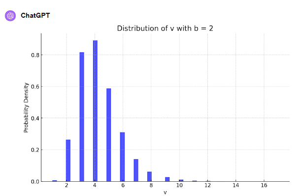
    			- 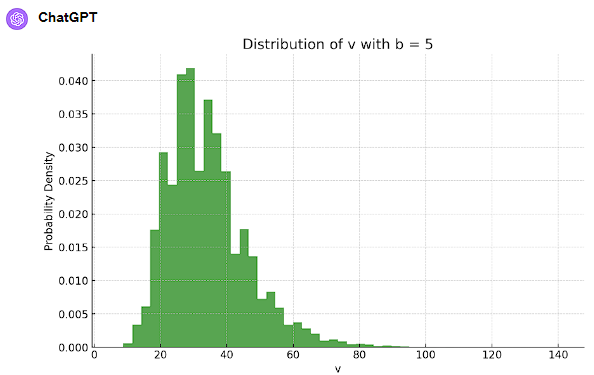
    			- 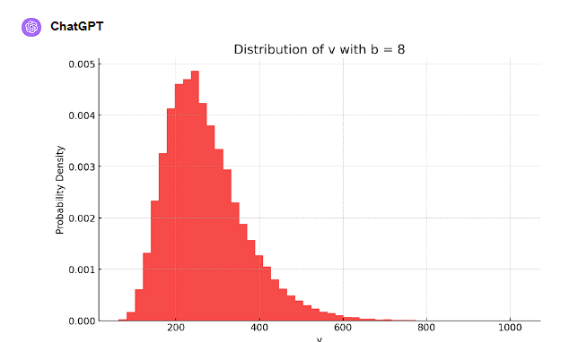
  			- 分布大体全部一緒かな……？
  			- 残務量の平均はまぁ2^b/2くらいで、この分布が大体2^b
    			- とりあえず平均価値3で見積もっておくか
        			- 中央値は2だけど上振れが大きいので。 
			- 通常労働カードで得られる平均労働力は25、コストも25くらい
			- 1枚買って使用する価値は、
				- 無料カード: 2ターンで価値4の生産
				- 通常労働カード: 2ターンで価値75の生産
			- 無料カードクッソ弱い！
    - 通常労働カードと全力労働カードの比較
      - どんくらい全部のタスクをやるかによる気がする……
        - でも基本的に全力労働カードの方が強そう
        - 上の考察からたくさんお金使ってたくさん進めた方が吉っぽいし
      - キャンセル系カードの方が先に考察すべきっぽい？
    - キャンセルカードの価値
      - まずは分布が大切
        - 労働カードの分布から
          - 適当に平均30, 分散10のグラフを出してみる
            - 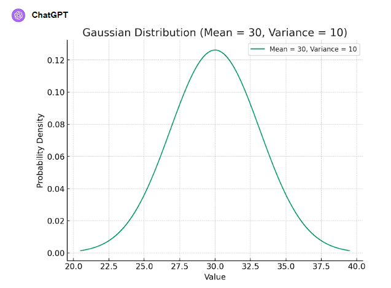
            - 効率に倍の差はつかなさそう？
        - プロジェクト1個を消費するために必要な平均ターン数は？
          - 通常労働の労働平均が25　（無料を1とする）
          - 全力労働の労働平均が25 * M
          - プロジェクトの残務平均が、b=5を採用するとして、32くらい
            - 1ターンとか2ターンとかで終わらね……？
          - キャンセルしてる暇があったら倒せ、みたいになりそうな気がする
            - 無料カードよりは流石に強い気がするけど。
            - K = 2とかでは買うし買うということは使う
    - 業務転換は？
      - かなり使いどころむずかしい
      - Mが多いときは全力労働が多分めちゃ強くない？
        - ってことは全力労働でプロジェクトがどんどん変わっていくので、やりかけプロジェクトが増えそう
          - ってことはキャンセルしたくないのが増えそう
      - 使いどころむずかしそうだなあ。すごい使いたいタイミングが来たら買うけど……くらい。
  - 何をやるにせよ強めの貪欲が必要な気がする
    - MCTSしたいんだけど、MCTSするには貪欲が強いのが絶対条件
      - とりあえず貪欲を組もう！
- 貪欲の組み方
  - とりあえずカード自体の価値とカード使用時に生み出す価値を適当に計算すれば良さそう。
    - カード価値高く見積もり過ぎるとカード使わなくなっちゃうので、カード価値の価値をちょっと低めに見積もって、いいカードどんどん使う感じにするのが良さげ

ここまでコード書かずにまったり考えて2時間くらい。短期コンだと絶対出来ない取り組み方だなあ。

- 増資カードってすぐに使っていいの？
  - 実はダメじゃね？と思い始めてる。カード購入にダイレクトに効いてくる
  - 増資カードを貯め込んで一気に増資！って戦略あるじゃんこれ
    - 増資カードの出現頻度や手札の数によっては温存あるわこれ
      - あるか？ ないかも
      - Lがいくつになってるかより、増資カードの入手数+Lが大切だったりしない？
        - するかも
      - そんな考えなくていいかも。
        - 基本即使用で実装しようと思ってたけど、一応やめようかな……。
        - 貪欲にやる時は即使用でいいと思う


### Submit 1：23.207 3位

- 雑にステータスの評価値を書いて、それを元に貪欲をした
- その後、何ターンか適当にシミュレートしてみるのを書いて提出した
  - 適当に840ケースくらい試した。そんなに変わらないっぽい
  - 0001がサンプル、0002が貪欲のみ、0003がランダム生成したデータで先読み
    - 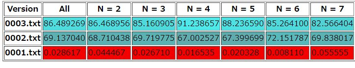
- 先読みの時にXを学習してみたけど意味なし。ぐぬぬ。
- 手元でサンプルが0.027なのに対して順位表だと0.662くらいある気がしてる。これデータ生成ちゃんとあってる？
  - なんかやたら合計点数が少ない気がする
  - ProjectやらmoneyやらがオーバーフローしてそうΣ
    - 大きいテストで0点続出だったっぽい……？
    - 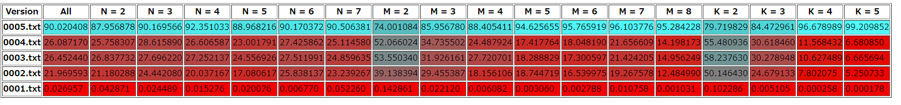
  - でもTesterだと大半L=20になるのにvisualizerからとってきたデータだと大半L=20いかないなあ。謎。
  
### Submit 2：27.404 2位

- 良い貪欲を見つけるゲーでクソみたいな貪欲書いてるからまぁまだ大した点数が出ないのは当然だけど、上にKiriさんがいるのはさすがだなあ(37.670)
- テスト改善したいけどその前にローカルと実際のテストデータにめっちゃ差があるのをなおしたい！
  - 調べてみたら普通に生成ミスでした。
  - サンプルが0.68点に。ってことは小さいケースでも普通に負けてるね。

- 色々直したけど貪欲と大差ないものしか出来て無くない？
  - ただの貪欲によく負ける。そもそもやり方がまずい？
  - ちょっと長い時間回してみるかあ。実行時間10倍を0007で。
  - 10倍 vs 通常 vs 貪欲 = 86 vs 62 vs 50になった
    - 10倍強いけどKiriさんが130くらいのスコア出してるんだよなあ……。
    - やっぱ貪欲単体で100くらい出せる計算式にしないとダメそうな気がする。

- 状態の評価がむずい
  - 以下の要素を評価しないといけない
    - 残金
    - レベル
    - 残りターン
    - 残っているプロジェクト
    - 残っているカード
  - 順番に考えてみる
    - 残金
      - そのまま……でいいのか？
      - 残り金額が少なくて身動きが取れない状態にはペナルティを与えたさがある
    - レベルと残りターン
      - レベルは基本的にすぐ上げたいけど上に書いてある残り金額パターンだけ怖い
      - 残りターンはレベルと合わせて処理することが多め。最後だけ動きが特殊だけど本質的じゃないと思う
      - (2^レベル)*残りターン*適当な定数、とかを補正で入れとけば大体あげたいし後半やめとこってなりそう
    - 残っているプロジェクト
      - 残りHPと価値Vについて考えた時に、
        - 基本的にこのゲームは価値と労働力が釣り合ってるわけで、HP>Vのものはゴミ
        - ってことは大体 V - HPがそのプロジェクトの価値
          - でもこれだとどれ削っても価値が同じってことになっちゃう
        - そのプロジェクトの完遂したさ度合い、みたいなのを入れる？
          - 絶対入れる→1
          - 積極的ではないけどまぁやっても良い→0.8
          - こんなん使わん→0.5
            - 存在することがマイナスの価値だよ、というのをちゃんと示すために0にしない方が良さそう
              - キャンセルカードとかのため
              - 業務転換カードが有効に使えることはあるのか……？
          - なんかいい感じに傾斜つけたいな
            - V=HPのとき0.8
            - HP=0のとき1
            - 1-HP/V*0.2で良い？
              - こういうの事例出して考えないとわかんなくなる
              - プロジェクトが4つ
                - V=100, HP=3
                - V=100, HP=101
                - V=100, HP=200
                - V=10, HP=3
              - それぞれ重要度計算して(V-HP)掛けるとこんな感じ
                - 重要度: 0.994	 価値: 96.418
                - 重要度: 0.798	価値: -0.798
                - 重要度: 0.600 価値: -60.00
                - 重要度: 0.94 価値: 6.58
              - それぞれにPower=2を使う
                - 重要度: 0.998 価値: 98.802 価値上昇:2.384
                - 重要度: 0.802 価値: 0.802 価値上昇:1.6
                - 重要度: 0.604 価値: -59.192 価値上昇:0.808
                - 重要度: 0.98 価値: 8.82 価値上昇:2.24
              - 良さそう。ちゃんとHP少ないやつが先に使われるし、Vがでかい方が使われている。
    - 残っているカード
      - 通常カード
        - 価値=Powerで基本良い
          - 上の重要度の関係で価値上昇が序盤小さくなってるのが難しい
            - 価値=2の時、上の例で言うと、1,4番目には使えるけど2,3番目には使えなくなっちゃう
              - 3には使えなくていいけど2には使った方が良さげだよね。
            - 重要度と対応させる意味では適当な倍率かけておいた方がいいかも
              - 0.8から頑張って欲しいんだから0.79かける
                - Cost = 80, V = 100の購入がマイナスになっちゃう
                  - 実際この辺の価値どうなのかね。
                  - 一回で20分のプラスを生むのは強いし、ぴったり消化できない弱さもあるし。なやまし。
      - 全体攻撃カード
        - 通常カードの扱いにMをかけて、適当に減衰(0.7倍くらい？)させればいいかなあ。
      - 他
        - とりあえずカード価値0でいいや。即使用以外はややこしい気がするので。


# 12/23 2日目

いとこの結婚式なのであんまり作業ができなさそう。

- 寝る前に実行時間10倍と100倍を試してみた
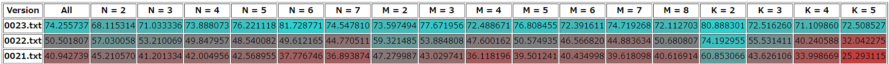

- 実行時間足りてないだけやんけ！！！
- ほんと？
  - 並列実行が悪さしてるかもね
  - 思ったより実行時間が大切そう
    - 差分評価を実装する？
  - 並列で走る数をめちゃ減らしてみた
    - 評価10倍の時とおんなじくらいになってる！
      - ゴミ！！！
    - ってことは時間を増やせば上位に追いつけるはまやかしね。
      - とはいえ実装することが悪くはなさそう。スコア1.5倍にはなるんだし。


- 結婚式から帰った！
  - 差分評価を実装するぞ！
  - した！
  
### Submit 3: 23.209 6位 (Ver28)

- これ実行時間上げたら上位に追いつく水準なんだろうか
  - やってみよ！（Ver29）
  - 全然伸びんかった。いや2割増しくらいではあるんだけど。
- 見てると「なんでそっち選んだんだろう」ってのが結構ある
  - AのあとB、と、BのあとA、が、おんなじ評価になってるのが原因っぽい？
    - どっちの方が先にやるべきか、みたいなのがない
  - しっかり探索出来てれば探索した方がいいんだろうけど、基本的には1手目評価が高いやつを選んだ方が良さそうよね。
    - そこを評価に足した(Ver30)
      - 普通に悪そう。削除。

- そろそろ根本的なアルゴリズムに向き合わないといけないかもしれない
  - ランダムな入力に対して貪欲シミュレーションをしている
  - そもそもレベルが上がる入力とレベルが上がらない入力の違いって何？
    - N, M, Kについて出力してたけどなんか違う気がする。
    - Guessの中身を見てみるか
      - Seed1 Score = 61088 Level = 5 N = 7 M = 8 K = 2 GP = 0
        - N, Mは良さそう。Kが悪いけど。
        - Guess: 487,204,209,120,31
      - Seed8 Score = 978214229 Level = 18 N = 2 M = 4 K = 4 GP = 0
        - 条件そんなに良さそうじゃないのにスコアが超高い
        - Guess: 510,1737,151,333,318
        - 全体攻撃かレベルアップだな……
      - Seed10 Score = 5251400 Level = 11 N = 5 M = 8 K = 4 GP = 0
        - Guess: 773,415,386,926,549
        - これは全体攻撃の数が重要だ！
- ちょっと全体攻撃の評価を変えて実行してみる
	- とりあえずwork×M×0.8で実行(Ver31)
    	- work×M×0.7(Ver32)
    	- work×M×0.9(Ver33)
	- 掛け算してるけど、この掛け方はおかしい気がしてる
    	- 1+0.8+0.8+...って感じな気がする
    	- M=2の時はもっと重くて良いしM=8の時とかはもっとダメそう。
        	- Seed8はM=4で動いてるし、M=4の時のバランスが0.8くらいなのかな
    	- そもそも今カード価値に0.83かけてるから、要求が0.6倍とかになってて鬼……。
        	- カード購入と使用がセットなので、即使用パターンくらいしか許容されなさそう。


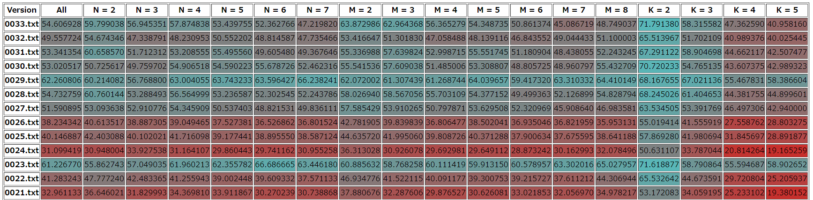

- 実行終わった
  - 0.7は低すぎて論外、0.9は良くなったり悪くなったりで傾向がはっきり出てる感じ。
    - Mについて
      - M=2、M=3は爆伸び
      - M=7,8はヤバげ
      - M=5くらいからバランス良い感じ
    - Nについて
      - 基本的には差がない……？
      - ブレがでかくて結果の見方がむずかしい！
        - そろそろテスト数増やす……？
    - Kについて
      - わからん。多分関係ない
    - まぁ考察通りMについてみれば良さそう。
      - M=2の時1.9くらいにしたい
      - M=5の時五分っぽいので4くらいにしたい
      - 2,3,4,5に対して、-0.1, -0.3, -0.6, -1.0で良い感じ……？
        - -M(M-1)/20.0
      - M=2の時は「未来に備えて買っておく」を許容する方向に
      - M=8の時は「即使用したい時以外は絶対買わん」という方向に
      - うごかしてみよう(Ver34)
        - まぁ狙い通り伸びたけど微差……
  
  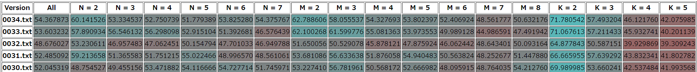

- こういう修正を行うタイミングではまだなくない？50%くらい伸ばさないといけないのに2%伸ばしてどうすんねん。
- 根本的なアルゴリズム改良、やるならどうするかなあ……。
  - 今やってることの整理
  - 「1手」を「買うものを決めて使うプロジェクトを選ぶ」の3つ組とする
  -	アルゴリズム
  	- まず1手全探索、評価値を列挙
    - 列挙したののうち上位A個を候補に採用
    - B種類の未来のプロジェクト、未来のカードをランダム生成し、Cターン貪欲でやってみて、スコアの和を計算
    - A個の候補のうち、スコアの和が一番多いのの勝ち
      - ……正しいのは和じゃなくない？積っぽくない？
      - 積だと溢れるからlogの和を取ると良さそうな気がする
        - 破綻して終わる奴を防ぎたいのと、レベルが上がった奴だけ重みづけが異常に上がる式は良くない気がする
      - そもそもレベルが上がった奴を評価するシステムってレベル上がる奴買えるなら絶対買っちゃうよね
        - type=4の期待度から、どれくらいで買えそう、って相場を計算して、直近Kターンで買える処理は即出来る扱いみたいなことする……？
          - やってみた(Ver35)
          - さすがにそれだとターン不利だから1ターンか2ターン分くらい消費して計算しないと合わなさそう。
            - スコアも2%くらい落ちた
          - 2ターン消費扱いにした(Ver36)
            - そもそも今1ターンで発生する収益を2^Lにしてるけど、これは妥当なんか……？
            - 無料で得られるのがこれだけど、これより良いものが得られることは多いので、もうちょい上げてもいいのよねえ。
              - ってことは2ターン消費扱いにしても2*2^Lしか変わらんのだから効果めちゃ薄いやん。ぬーん。
              - やっぱスコア良くなかった
      - とりあえず和を積(logの和)にするやつやってみる(Ver36 被せちゃった？)
        - ほどほどに伸びた。ほどほど。
        - Chromeのタブ減らしたから伸びたとか言われてもこれ分からんな……。
          - 前のやつで実行してみる(Ver39)
          - 37を実行してみる(Ver40)
          - 下がったやんけ！
            - 誤差ってことにしよ……。

根本的なアルゴリズムの話に戻る
- 貪欲シミュレーションをたくさんやるのがダメそう？
  - でも未来はわかんないから先読みするのも変な話だよね。貪欲が十分強いならこれで良い。
    - そもそも先読みで出せるものを貪欲で出せるようにしたい……。
      - そういう文脈で言うと機械学習っぽい？
    - とりあえず機械学習の前に人間学習。貪欲でこれが良かったけど実際は違った！みたいなのを列挙してみよう
  
### 観察フェーズ Seed 0

```
Turn 1 select 1
Sell Cards:
id0 Type:0 Power:1 Cost:0
id1 Type:3 Power:0 Cost:2
id2 Type:1 Power:45 Cost:62
My Cards:
id0 Already Used
id1 Type:0 Power:39
Projects:
id0 HP: 15 Value: 25
id1 HP: 4 Value: 7
Greedy Choice: Buy Card 0, Use Card 0 for Project 0
Search Choice: Buy Card 0, Use Card 0 for Project 1
```

- 初手から違うやんけ！
- N=2だと手が狭いから苦しんでるのがわかる……。
  - 7/4 > 25/15に見えるし、なんでこれid1をGreedyで選ばないんだ？
    - 評価関数間違ってない？
    - みた。「ゴール時の評価」を増やすために、ベースを増やす処理を行ってて、両方分子から6を引いてる
      - 激ヤバやんけ。
      - return (long)((V - HP - (Math.Max(1, 8L - F.N) << L) * 1) * needValue * 100L);
    - とりあえずこれ除くか……。(Ver41)
    - でもこれちゃんと後のGreedyによって解消してるの偉すぎだなあ。（1度選んだ奴は連続して選んで倒そうぜ！をシミュレート側に入れてる）
      - （追記）Ver41結構落ちた。なんでや！
        - Nが小さいケースでちょっと伸びてて、Nが大きいケースで死んでいる
          - これ多分「終わらせられるものを早く終わらせる」にボーナスつけようとして評価ミスった系じゃないかな……。
            - 不等号を逆にしてみた。「終わりそうなやつを削る」って方向性。こっちのがいいでしょ。
            - スコア1/3になったんですが……。
        - どういう気持ちで作った評価関数なんだろこれ。
          - 価値を低く見積もっておくと完成した時に嬉しい、って奴かな……？
            - そういう意味では探索で結果的にたどり着けてるし良い気もする。
        - とりあえずスコアのみで調整しながら考える (Ver43)
          -  ゴールすることによる価値は外から与えれば良くない？
             -  与えすぎるとバランス崩壊しちゃうのかも？
             -  価値を不当に低く見積もるよりは、撃破インセンティブを一時的に用意してあげて貪欲で選ばれやすくしてあげる、みたいな方向性のが良さそう？
             -  わからん。
             -  「ダメージを与えすぎると無駄になる」というのが結構いたいんだけど、とはいえ中途半端なものが残るのも良くないから、って感じでバランス調整してるんだよな多分。
                - Nが大きいと調整可能だからバランス調整可能かな、と思って重みづけを軽くし、Nが小さいとバランス調整しづらいかな、と思って重くしたのかな
                - でもなんかめっちゃ裏目に出てそう
          - なんか調整したらスコアめちゃ伸びた。うれしい。

実行しなおし

```
Turn 7 select 1
Sell Cards:
id0 Type:0 Power:1 Cost:0
id1 Type:3 Power:0 Cost:6
id2 Type:0 Power:18 Cost:6
My Cards:
id0 Already Used
id1 Type:0 Power:44
Projects:
id0 HP: 14 Value: 25
id1 HP: 152 Value: 72
Greedy Choice: Buy Card 1, Use Card 0 for Project 0
Search Choice: Buy Card 2, Use Card 0 for Project 0
```

- これはカードの評価の話
- Type3が強いと思ったらそんなことありませんでした、みたいな話。
  - なんでこれType3だと思ってるんだろ。id1がゴミだから？
  - パっと見改善しなさそうなのでとても正しそう。
    - Type3の評価どうしようね。M=2なら使いどころ全然あると思うし捨てる必要はなさそうなんだけど。
    - 多分マイナスのものの評価値が高すぎるのが原因なんだろうなあ。
      - 評価値の要見直し。

```
Sell Cards:
id0 Type:0 Power:1 Cost:0
id1 Type:0 Power:4 Cost:5
id2 Type:0 Power:4 Cost:3
My Cards:
id0 Already Used
id1 Type:0 Power:44
Projects:
id0 HP: 71 Value: 55
id1 HP: 37 Value: 36
Greedy Choice: Buy Card 0, Use Card 1 for Project 1
Search Choice: Buy Card 2, Use Card 1 for Project 1
```

- Power - Costが同じ中でどっちを買って使うかの話
- 基本的には無駄になるのを恐れて0より2の方が評価が落ちるんだけど、高速に回すという観点においてはPower>Costなのよね。
- 無駄になるのを恐れず買っちゃうのをデフォルトにした方が良い気もする
- 探索結果を予想して機械学習、みたいなこと言ってたけど、「アグレッシブに攻めてみてダメかどうかは探索で確認」って思想の方が良い気もしてきた。そのための探索。
  - 日和った評価関数を捨てろ！！！


評価関数の調整をするぞ！

- 負の奴の存在価値をめっちゃ下げてみる？
  - なんかめちゃ悪くなってそう。
  - 多分キャンセル系のカードの優先度が落ちて、その結果厳選が全然効かなくなってる。
- とりあえず日和った調整を捨てた
  - 優先度の基準を0.8から0.95に
  - PowerとHPのバランスを0.83倍から0.97倍に(Ver45)
    - これ1つ目>2つ目なのおかしくね？
    - 0.91倍くらいにしてみる(Ver46)
    - どっちも悪そう
    - 0.91倍のままで優先度の方を0.8に戻す(Ver47)
    - のびた！！
    - 0.97倍にしたら行けたりしない？(Ver48)
    - のびるやんけ！
      - 評価関数の調整で結局ゴリゴリ行けちゃってるけど、あんまりこのタイミングにやりたい手ではない……。
        - でもそれで結構伸ばせてるから良いっちゃ良いのかもしれない。
        - 局所解にも陥りやすいから気を付ける。既に陥ってる気もする。プロジェクトランダム生成してシミュレーション、ほんとにいいの？
          - 他浮かばないんだもんなあ。第一感MCTSだったけど、MCTSって先が分かってる動きになっちゃうので、貪欲シミュの方が正当性あるし。
    - 優先度を0.95にするのがめっちゃ悪かったんだから、これ0.6とかにしたら伸びたりしない？(Ver49)
      - こっちは下がる(1.5pt) 2%とかの表記めんどいからpt表記にしよ
      - 優先度とカードのパワーバランスは合わせるべきだと思ってたから、ここに差が出るのはわからんのだよな……。
      - プロジェクトをキャンセルして正の効果のものを倒す前提だと、実は元々1倍以上の価値があったりする？
        - プロジェクトは0.8掛けでも結局半分で殴ったら0.9とかになるし。
      - ってことは結構ここの細かい調整効いてくる気がするな。ちょっと調整しよう。
        - 間をとって0.7くらい。(Ver50)
          - ちょっと伸びた。1.3pt
          - なんだかんだ前の提出から13pt伸びてるんだよなあ。1.3倍くらい。
        - もうちょい上側な気がする。0.75(Ver51)
          - +0.6pt
- ちょっと小さいケースが時間余ってそうに見えるので探索バリエーション増やしてみる(Ver52)
  - そんな意味なかった
- 同じ候補を探索してそうなことに気付いたので、同じカードを2つ持ってたら探索対象から外してみた(Ver53)
  - 結構伸びた +4pt
  - K=2ですら3pt伸びてるし、探索候補数足りてないのかな。
    - シミュレート回数増やすより候補数増やす方がいいのかもしれない
- Ver52意味ないと思ってたら1個else ifのelseがなくて全部上書きしてた
  - 小さいケース全部爆速で終わってるじゃんこれ。
  - 修正した (Ver54)
    - 結局伸びなかった
    - 10回くらいシミュレートすれば十分ということなのかなあ。
    - であれば深さを増やしたい気もする
      - レベルを先にあげて金欠、みたいな状況にマイナス補正をつけたい
        - ほんとにつくかな？
  - 先読み数を重点的にあげてみた
    - やっぱりあんまり変わらず。

- レベルアップの所弄ってないのおかしくない？
  - ガシガシれべるあっぷしてくのに書き換えてみた
    - seed2とかseed8とかLevel16止まりだったのが20にあっさり乗ってる
      - 抑制し過ぎだったっぽい？
    - ちょっと変えてみた。どちゃくそ伸びた。(Ver56 +26pt)
      - これ提出すれば1位だな。提出しとこ。

## submit 4: 23.982 (3位) Ver56

- ……なんか出すの間違えた？
  - あってそう。
  - ローカル順位表と手元の結果が合わなさ過ぎる


  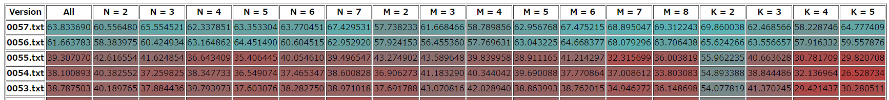

出したのこの56よ……？前に出した27は27.13点よ……？

  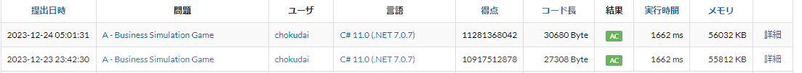

ローカルの結果はこれ。
合計値がそんな一緒にならないことある……？

- とりあえず合計値を出してみる
  - 0028.txt 163586846587
  - 0029.txt 204708264295
  - 0055.txt 214320906615
  - 0056.txt 363887403966
  - 0057.txt 373221324918
  - 0058.txt 345783414543
  - そらそうなのよ　流石に合計値が一緒なわけないのよｗ
    - 爆速で動いてる可能性も考えたけど、29が28の高速版なわけで……。
  - とりあえず出し間違いを考慮する
    - スコアの良いやつをまず実行(Ver59)
    - 次に提出コードをコピって実行(Ver60)
      - かわんねえ……。
        - 今までと違うタイプで点数が稼げるのが来たから点数が増えた？
        - 自分の点数の取り方だけ他の人と全然違かったりする？


- 隠れ変数Xに依存し過ぎな気がしてきたなあ。
  - 今結局、点数が大きいケースで落としてるのか、点数が小さいケースで落としてるのかもよくわからない。
    - 点数をlogスケールで分けてそれごとの得点分布を出す……？
      - 直感的には良さそう。
      - Xに依存した戦略も多分取らないといけないんだろうなあ。


  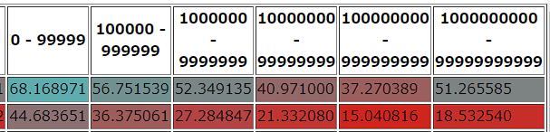

- 2提出について上のようにスコア別で評価する
  - サーバー上での点数アップは17→24で約1.4倍くらい。
  - この各要素の倍率はそれぞれ1.54倍、1.55倍、1.92倍、2.46倍、2.76倍
    - 840テストケースを満遍なくやって全体では2.00倍
      - 最初の頃は2.5倍くらいあったけど気づいたら2倍になってた
      - まぁありえなくはないのか……いやありえないけど……。

Submit 5: 25.871(3位)	Ver67

- 出して見たらちょい伸びたし提出の点数もちょい上がってた。
  - でも表を見た限り「ちょい上がる」なんてことは起こりえないように見えるのよね……。
    - 何が起こってるんだ……。
  - コードテストをやっても回ってる数とかローカルと大差ないし、本当に謎だ……。
- とりあえず時間10倍回してねる！

- 明日やるめも
  - 詰み対策　手持ちで倒せる状態でなくなる場合にアラート
  - 0.97倍より上を試すの忘れてたから試す。

# 12/24 3日目

- 時間10倍、スコア落ちてるんだけど……。 -7pt (Ver68)
  - 適当に時間をたくさん使う上位オプションを消したら元に戻る (Ver69)
  - ってことは先読みが悪さしてそう？
    - 時間に余裕がある時は13ターン先読み！ってしてたけど、普通に5ターンの方が良さそう
      - 上位オプションを5ターンにした(Ver70)
        - これも下がる(-3pt)
          - なんで！？
        - 上位オプションの要素は3種類
          - モンテカルロの試行数
            - そういやランダム実行＋貪欲ってモンテカルロだなこれ
          - 初手候補として扱う手の種類数
          - 何手まで先読みするかの数
        - 先読み数を固定(全部5)にしたのにダメってことは試行数か種類数
          - 試行数を増やしてダメになるってことある……？
            - ドボン選択肢を引いた数が実質的な評価になって、普段は0だから大丈夫、とかはあり得る
          - 初手候補を増やすことでマイナスになることは？
            - それなりにありそう。探索が負のフィードバックを与えちゃう場合に、そもそも初手候補から除外するべきものを入れちゃう的な。
              - いやそれは探索がまずいんだけど……。
            - とりあえず初手候補を減らす(Ver70 上書きしちゃった)
              - best -0.5pt これは誤差かな。
              - 点数が取れるケースで落としてそうなのでもっかい実行 (Ver71)
              - best -2.5pt なんやねん
                - 800ケースくらい試してこの差出るの、めっちゃ詰めにくい……。
                  - そりゃ50ケースじゃなんも分からんわ。
              - 上位オプション自体消す(Ver72)
                - best -2.5pt マジでなんやねん　
              - 戻してあんまり気にせずいくか……。
                - 探索が深いのはヤバっぽいのでそれだけ避ける。
- とりあえずカードのPを1倍以上の価値にするやつやるか。
  - 消費するプロジェクトの価値見積もりが必要
    - どれくらい捨てるからどれくらいの価値が平均して生み出されるか、みたいなの
    - N → 手札の数は使用するプロジェクトにそんなに関係なさそう？
      - キャンセル札を常時ストックしておけるか、みたいなのはある
      - 強いて言うなら使用効率が上がる
    - M → 存在するプロジェクト数は関係ありそうではある
      - でも1個ずつ倒していくんだから、M倍良いのを選びやすい！みたいなことはないよね
    - K → 適切なカードを買いやすくなる、というのはプロジェクトの価値見積もり上どうなんだ？
      - 適切にキャンセルが使えるわけで、厳選はしやすそう
    - なんか言うほどクリティカルじゃない気がしてきたな。雑に1.05倍とかにして様子見よ。(Ver73)
      - 普通に満遍なくめちゃめちゃ悪くなった
      - まぁ5%減衰するものをプラスとして見るのは流石に厳しいよね。
    - とりあえず1.00にするかあ
      - これも端数考えてないからめちゃめちゃ攻めだけど。(Ver74)
        - だめそう。戻すか。細かい調整にしかならんので放置。

- 詰み対策をしたい！
  - 詰みという状態を定義すると、以下の状態になること
    - お金が足りずにカードが価値0のものしか買えない
    - 倒せるプロジェクトがなく、お金を増やせない
  - 労働力はrand(1,50)*2^Lなので、平均25ターン詰む
    - 例えばL=20を目指すなら、50ターンに1度レベルアップしないとダメで、その時にrand(200,1000)*2^Lを入手しないとダメで、randで300引けるとして、1ターン当たり6*2^Lくらい生み出さないといけない
      - 意外とぬるい？
    - 単純に「資産に余裕がないと動きが悪くなる」みたいなことは言えるんだよな
      - でも購入基準引き下げたらスコア上がったのを見ると、基本的にレベルアップはして良いものに見える……。
      - 以後、2^LをLLと書きます（打つのがめんどくなった
    - 無料カード能力：1LL
    - プロジェクトHP平均：25LL 　←（追記：嘘でした）
    - カード攻撃力平均:25LL
      - どんくらい余裕がある状態で立ち回るもんなんだろ。
      - プロジェクト平均×Nくらい欲しくない？
        - それだけあれば自由が奪われなさそう
        - でもN=8の時200LLだよね
          - 200LLで買うなら2倍じゃん　そりゃ無理よ
        - 必要先読みターン数はNに依存する説ない？ 
          - Nが小さいときは詰むから先読みしたい
            - 25ターン詰むなら25ターン分くらいは読みたい
            - 60/Nくらいか？
          - Nがでかい時は先読みいらん気がする
            - 攻撃カードが手札にあれば詰まないんだから、お金がほぼ0になっても攻めて良い
            - N=6以上で5とか。
            - 100/N/Nとか？ほんと？
            - ちょっと色々試すか
        - まずは25/N (Ver75)
          - N<=4から増えるくらい。
          - なんかマイナスになってそう

- なんか順位表ヤバいことになってる ねる前がこれ
 
  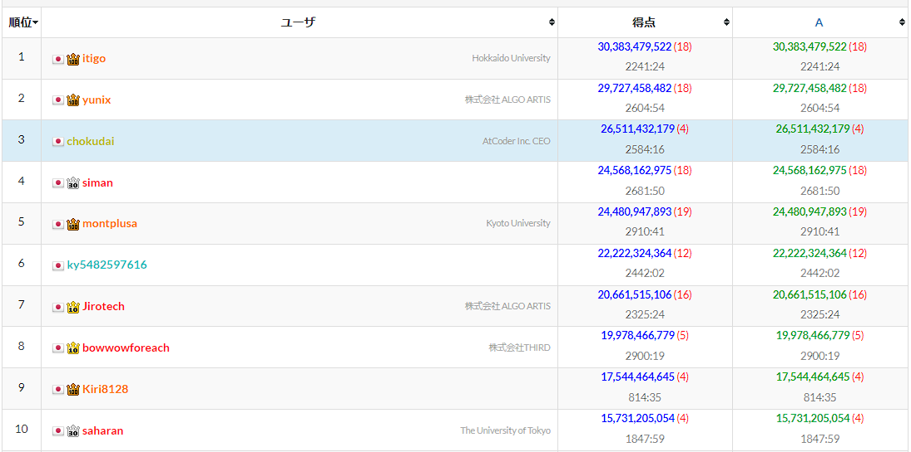

  今がこれ
  
  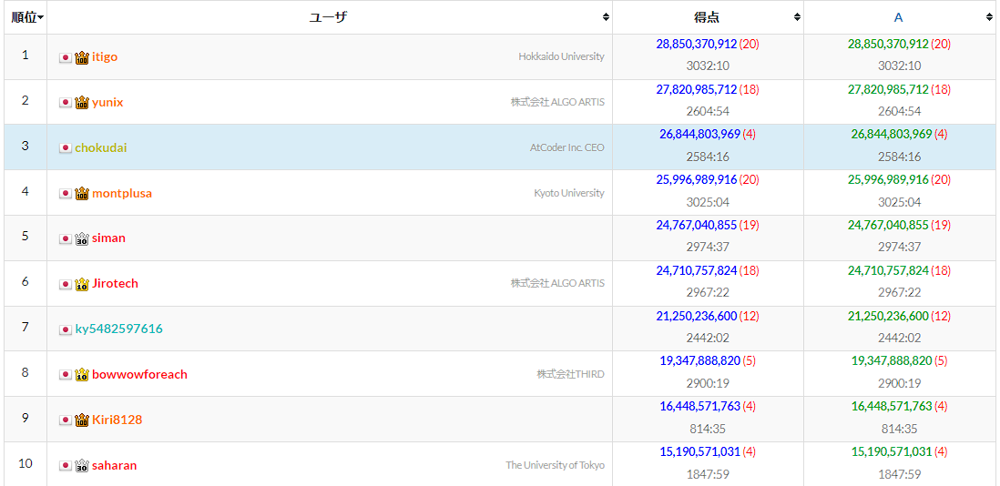

- 見えてる人で提出してない人の変化を見る
  - yunix		29.727 → 27.820
  - chokudai	26.511 → 26.844
  - ky548259716	22.222 → 21.250
  - Kiri8128	17.544 → 16.448
- なんで一人だけ上がってんねんｗ　AtCoder壊れたか？？？
- これほっとくだけで一人だけ点数が上がり続けて1位になったりしない？
  - 低点数帯か高点数帯か、どっかで無双してんのかな……。
  - 多分低点数帯で勝ててて高点数帯で超負けてるんだと予想してる
    - 点数の上がり方的にそれしかありえないので。
    - だとするとシステムテスト負けるんだよな……。
      - 自分の獲得点数が13059467785点、自分のローカル最高点が9284233679点
        - 1.4倍しかない。ってことは低点数帯が多そう？
        - 上位10%帯が2953824572だから、特別これが高いわけでもない。
          - といいつつ3倍くらいはあるけど。
      - 何がどうなるとそんな点数出るんだ？
        - 常に全体攻撃で最高効率を出すとそんなもん？
        - 攻撃対象が8として、omega=rand(1,50)で標準偏差omega/3くらいだと見た時に、K=5ならまぁ平均で5*M=40くらいの価値を出せそう。
        - これをLevel20で500ターン続けると20000LLくらい。
        - LL=1000000とすると20000000000くらい
          - 並べてみる
          - 20000000000
          - 9284233679
          - 倍くらい。じゃあやっぱ理論値こんなもんなんだな。
          - 全体攻撃やっぱクッソ強いな……単体だと/8だからねえ。
        - やっぱ全体攻撃の重みづけめっちゃ重要そう。ここで損してるんじゃない？
          - ちょっと調整したいね。
- なんか点数が全体的に低い気がする
  - 67っぽいのを動かす(Ver76) 
  - なんか今までで一番スコアがいい……
    - なにもわからない……ｗ
  - とりあえず2倍時間で実行してみるぞ　おかしいのが再現するかの確認（Ver77）
    - 特に再現しなかった
  - 5倍で動かしながら色々かいてみよ(Ver78)
  

- やるべきこと整理！
  - 抜本的なアルゴリズム改革はあり得る？
    - 単純なモンテカルロより良いものがあるか？
      - 探索範囲を絞るとかはあり得るけど細かい気がする
        - レベルアップカード持ってたら絶対使うよね、とか。
          - 買う買わないは択になっても使う使わないは択にならない、みたいな話
            - こまかい！
      -  先が見えてる前提の探索を行うかどうか
         -  MTCSとかはどうしてもそうなる
            -  「先の結果が良かった」というフィードバックを与えて手を変えるのは普通に先読み探索
            -  興味があるのは「取れ得る選択を選んだ時にどんな結果が得られるか」で「エスパー状態の時にどんな結果が得られるか」ではない
            -  だからといって「先の未来」を複数分岐して計算する、とかやるとやべーことに。
               -  分岐数^深さなシミュレーションになっちゃう。
               -  流石にそんなんやれるわけないでしょ。
         -  焼きなましは？
            -  焼きなますものがねえ！
         -  ビムサは？
            -  これの後にこれを使うと良い、みたいなのは多分出てくるよね。
            -  これとこれとこれの3つで殴ると効率よく倒せます、みたいなのは今ない
               -  あってもいいな……。
            -  高々3つに抑えるとN^3とかか。
               -  普通に重いな。
               -  ぴったりじゃなくても全体攻撃でカスをなぎ倒せれば全然いいんだよな。
                  -  そう考えると全体攻撃ほしい。攻撃力小さめのやつで一掃するお仕事してほしい。
                  -  いやでも「カスを残して全体攻撃で一掃する」ってムーブ、するか？
                     -  プロジェクトを現金化するのめっちゃ大事だからあんまりしなさそう。
                     -  カスは無料カードで倒しましょ。
                  -  じゃあやっぱりぴったり倒す価値が高いのか。
                  -  2つで倒すのは初手全探索+そのあとの貪欲でいくらでも見つかるから、3つ以上だなあ。
                     - だいたいHP=Powerなのにそれ考慮する必要ある？- いやそもそもそれ嘘じゃない？
                     - Powerは大体25.5LLじゃん？
                     - HPは2^5だから32じゃない？
                     - 大差ないか。
                     - 平均じゃなくて中央なのがこわめ。
                     - 平均だと2^8 * 2 / 7とかかな。
                     - 大体2^6くらい。64
                     - そうなると大体3つで倒すなあ……。
                     - 攻撃力高い順にA,B,C,D,Eがあったとするじゃん？
                     - 3つの攻撃パターンにAが含まれるなら全然おっけー
                       - どうせAから殴るので
                     - ってことはダメなのはB,C,Dとかやらんといけないパターン
                       - そんなんある？　あるか……。
                     - A, C, Dとかはめっちゃありそうだけど、Aで殴った後の話だから全然気にしなくていいのよね。まずAで殴れ
                       - Bで殴った後にAでまだ殴れるけどC,Dで殴った方がいい、みたいな感じになってる時のみダメなんだよな
                         - そんなことある？？？？
                         - 10, 9, 8, 7, 6で、HPが24の時、10で殴ると……。
                           - 影響ちっちゃそうじゃない？
                           - 影響激ヤバなケース作れる？
                             - 作れはするけどそんな偶然発生しなさそう
                         - 探索しないでいいことにする！ヨシ！
                           - じゃあ何すんねん
         - モンテカルロとかしないで最強の貪欲を作る方向性は？
           - 組合せの列挙とか戦術を考えて評価する感じとか。
           - 貪欲だけでモンテカルロを越えられる気がしないなあ……。
           - 貪欲が強くなれば当然いいんだけど、差分評価が前提なのがつらぽよ。
- なんも浮かばねえ！詰み対策ちゃんと作ろ！
  - さっき考えてたら普通に平均64LLとかで死にそう、ってことが分かった
    - 中央値32LLだからどっちで見るかは難しいんだけど。
    - M=1のことはないし……。
    - レベルアップ直後に存在するプロジェクトは前の状態だから/2にしてみた方が良い、というのもある
  - 評価値でどうにかしたさがあるが……。
    - 「金がないのが嫌だよね」的な方向だと、「最初のプロジェクトを倒すために頑張って安くてコスパの良いカードを買ってHPを削る」ってムーブが不利行動に。
    - じゃあプロジェクトの残りHPを評価に加えると、最小値とか見るのか？ってなって、それはそれでむずかしい。
    - 金＋カードだけだと、プロジェクトに攻撃するのが不利行動になるのでカードが溜まる。
    - 金・カード・プロジェクトを見て全体的に評価するしかないか……？
      - 差分評価がゴミになる。
    - とりあえず金だけ見る奴組んでみるか。
      - 必要資金を50LLとして、50LLない状態はめっちゃ嫌！みたいな感じにしてみる。
        - 程度問題だけど。
        - いや微妙そう。やっぱ変な状態に入っちゃうので貪欲との相性が悪い。保留！
- 価値判断の適正化をしよう
  - 時給ってのはレベルアップペースから大体見られる
    - レベルアップにだいたい300LL使う
    - ってことは時給は300LL/AverageLevelUpTurn
      - AverageLevelUpTurnは普通にレベルアップの割り算で。
        - 各状態ではなくマスター状態のレベルを見ないと、先読みするターン数が変わっちゃうことに注意
      - 最初は適当に300/Kとかにしとく。
    - AverageLevelUpTurn分くらいだけみて、払うお金がちゃんと適切かどうか見てあげたい。
      - なんかそれだとシビアになり過ぎるっぽいから2倍にした
  - めっちゃ上がった！(Ver79, 23pt Up)
  
# Submit 6 29.981(2位) Ver79

- レベルアップ判断のとこでかすぎるなあ……。

  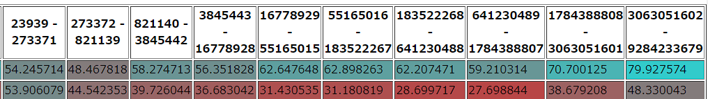

- 点数を上位1割、2割、って感じで分けて表示するようにした。
  - 満遍なく伸びてるけど下2割が明確に悪い
    - 伸びてはいるんだけど。
  - 300LL/Kの見積もりが悪いのかな？
    - 1500LL/K/sqrt(N*M)とかにしてみた
      - ちょっとわるくなった。
      - 下の方は良くなってる気がする。
      - SQRTが重くて実行速度に影響あったのでは？
        - これ1000回しか更新されないし、普通に評価関数の外部で計算するか
        - やってみた(Ver81)
          - 4ptあがった。うれしい。
  - 2倍にしたとこ雑過ぎるから調整しよう。
    - 1.5倍(Ver82)
      - best -2.3pt
      - K=5のパフォーマンスはほぼ変わらず。
      - スコア別でみると上位4割のパフォーマンスはほぼ変わらず。
      - 小さいケースだとめちゃめちゃ落ちてそう
        - 小さいケースだと見送り判断しちゃうとかそういうのなのかな……。
    - 3倍(Ver83)
      - -13pt。多すぎらしい。
      - なんか弄っても1ptくらいしか伸びなさそうね。
  - ConsiderTimeの方に掛け算するべきなのか最後のところに掛け算するべきかわかんないね。
    - ConsiderTimeをそのままにして得られる点数期待値を2倍にしてみる(Ver84)
      - 大差ないけどちょっと落ちた気がする
      - もどそ。
- 詰み対策をしたい！
  - 最後だけ最後まで読んだ結果にすればいいんじゃね？
    - した　24ターン (Ver85)
      - best -2pt
      - ダメっぽい。
  - 詰み対策したいってずっと言ってるけど何も出来てないなあ。
- 差分評価と差分じゃない評価を今持ってるけど、差分じゃない貪欲のほうだけでも評価まともにしない？
  - どうやって？
    - 現資産でどれだけ生産出来るかを考える
      - 資産の見積もり
        - 金：そのまま
        - カード：通常攻撃と全体攻撃だけ見る
          - 通常攻撃：攻撃力をそのまま金と見る
          - 全体攻撃：プロジェクトを金で削る
        - プロジェクト：HP≧Vは無視。HP＜Vの場合は、資産がHPを越えた時にV-HPが得られる。
        - この時、50LL(仮)に到達するためにかかるターン数を「足踏みターン数」とする。
          - カード消費とかは0ターンとして、無料カードを得るのだけ1ターン
          - これはプロジェクトをソートして貪欲で解ける
        - 足踏みターン数から適当に評価値を求める
  - とりあえず組んでみた。うごかす！(Ver87)
  - バグってたのでやりなおし！(Ver88)
  - さらにバグってたのでやりなおし！(Ver89)
    - -1.6pt。50LLがやりすぎ？
      - 20LLとかでも十分抑止力になりそうなので入れてみる。(ver90)
        - -1.2pt　あんまり変わらず
      - この基準はMによって変えるべきかもね。(100/Mとか)
        - 60/Mでやってみた(ver91)
        - だめなので30/Mにした(Ver92)
        - おちてた early returnいれて50/M (ver93)
    - 全然ダメや
      - なんかVer84の修正が残ってたっぽいのでVer90をやりなおし(Ver94)
        - 普通に変わらなかった
        - でも比較対象が上振れしてるだけな気がするんだよな
          - Ver81を走らせる(Ver95)
            - best -2ptくらい。
        - じゃあ94が一番ええわ！
- 2倍適当にしてるとこ調整するよ！
  - なんかM=2の時に1.5が一番良かったっぽいのよね
  - 1.2*0.1Mにしてみる (Ver96)
  - 上の方が足りないっぽい。1.0*0.15Mにしてみる(Ver97)


- 組む予定だったの大体組んじゃった気がする
  - なんかあるかなあ
  - Levelの買う買わない判断考えるか
    - 今は「買った後の状態」を見てる
    - でも実際は「お買い得かどうか」をある程度見た方が良い気はしている
    - でもあんまりいい手が浮かばないなあ

- なんかギリギリ関数が効かないの意味わかんねえ！って思い始めたので、倍率あげて正負逆にしてみた
  - seed0とseed8で見たことない点数出してる。なんやねん
  - なんかおかしいね
- 評価関数を色々出力してみてたら、なんかNaN同士で比較しているところがあった
  - レベル21になった時に差分評価の時だけ点数が天元突破してたっぽい
  - なおした (Ver105)
    - 2ptくらいあがった。しょーもなｗ
  - 足踏みロジックがうまくいってなかったのもこれと干渉してた可能性があるので実行(Ver106)
    - -1.5ptくらい
  - 一応Ver107を再実行
    - 再実行増えてるしそろそろテストケース倍にしようかな……。
    - 足踏みはNが小さいと発生しやすいっぽいので30/Nで実行することにした(Ver108)
      - 細かいからこんなん詰めてもしゃーなさそう
- レベルアップまでの時給計算、普通にバグってた
  - なんでこれで点数爆伸びしたんだ……
  - 修正したら伸びた(Ver111)
    - これ足踏み入ってるけどいいのかな
  - 足踏み抜いた(Ver112)
    - 入ってる方が強いわ
  - 足踏みボーダーを15から30に(Ver113)
    - 過激でもほぼ一緒。びっくり。
  - 足踏みしたら即死みたいな設定になってるの普通に酷いかな
    - 50まで見るけど1ターン足踏みにつき1000ターン分減点してたのを普通に1ターン分減点にした(Ver114)
      - 穏やかな方がいいでしょ流石に。 +1.2%
    - 50はやりすぎかもしれんので30でためす(Ver115)　-1.2%
      - でも動きやすさ考えると100くらいまでは価値を見てもいい気はするんだよなあ。
        - 0の時のヤバさと50の時のヤバさを同一視しない方が良いけれども。
    - なんか足踏みヤバさを定量的に表したいな。
      - 都合の良い+ω/2くらいのものを買えると仮定しよう
        - 仮定がだいぶ甘い？
        - 甘いかも。
      - とりあえず100で動かしてから考えよ
        - いくつか動かしたけど明らかに弱い
          - まぁそりゃそうよね
        - 0→1は絶対1ターン必要なんだけど、50→60とかは1ターンでできたりするのよね
        - max(1,1/10)は動ける、みたいな仮定を置こうかな。
        - 100の時の速度が10で10まで行くと速度1、そこから先は落ちる、みたいな。
        - 計算式むずーい！

現在の順位表

  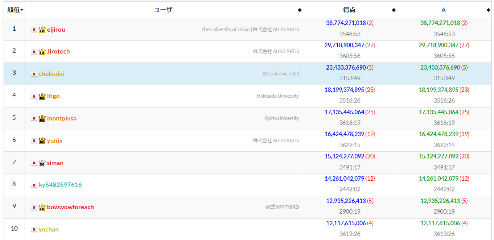

- Jiroさん抜いてから提出しようと思ったら別のjirouさんが……。
- 1割ちょっとしか伸びないだろうから出してもなあ、と思ってるけど、順位表情報は取っておいた方がいいのかな。
- いくつか詰めてみて出しましょう。

# Submit 7: 29.428 2位 (Ver 118)

  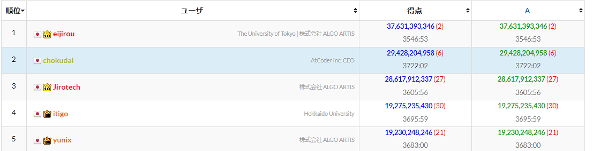

- なんでJiroさん抜いてんねん！ｗ
  - 抜ける予定じゃないんだけど！
- 足踏みアルゴリズムで安定性が増した？
  - でもいくつかのケースで明らかにスコアが伸びなくなってるんだよねえ。
    - Seed7とか。　
  - あんまり順位表に踊らされ過ぎない方がいいなこれ……。


- レベルアップの購入タイミングわからん……と思ったけど
  - レベルアップアイテムが来る確率が求まってる
  - レベルアップのペースも求まってる
    - レベルアップアイテムのうち、買うべき金額が求まる
      - レベルアップペースの何割かで来るアイテムのうち最安値、みたいなのの期待値で良い
    - お金が微妙な時の足踏み基準も求まってる
      - これはマイナス金額に換算できる
  - これだけあったらこの辺のお金の計算だけで買う買わない判定できるじゃん！
    - できた。(Ver120)
      - -6ptくらい。うーん。
    - この路線はなしかなあ。一応もうちょい詰めても良いけど。
      - とりあえず平均レベルアップ期間の1.2倍より残り時間が少なかったらレベルアップ買わない処理の1.2を1.02に変えた
        - もう1個レベルアップ出来るところまで余ってるのに買わないのはやりすぎ
          - もしかして0.8くらいでも行ける？
          - レベルアップ1個分が200LLと仮定して
            - そのままのレベルで行くなら+200LL
            - 1個あげるなら200LL使って400LL獲得
          - 普通にぴったりだから1.0でいいや。
    - なんもわかんないから実行時間10倍で寝る！(Ver124)


- 実行時間10倍、普通にめっちゃ成績伸びてる
  - best +5ptは普通にでかいなあ……。
  - 点数が下2割のケースで+10pt以上してるのがめちゃめちゃでかい
    - 低点数には探索が効くのか……？
    - 低点数って探索しきってると思ってたけど。
  - 実行時間配分調整したらどうにかならんかな(Ver125 ←消し)
    - best-3pt。ぐえー。
  - とりあえず見やすいように再実行(Ver125)
    - バージョン名整数にしちゃったけど普通に文字列にすればよかったな……ｗ
      - 125Longとかつけるとわかりやすい
      - 次回のAHCからそうしよ。


  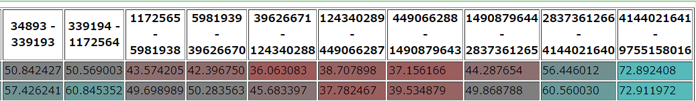

  - 高点数帯は変わってない
  - 低点数帯はめちゃ伸び
  - いやそうでもないのかな。超高点数帯はまぁ点数が安定するもので、それ以外は十分伸びてないか？
    - なんかミドルレンジが伸びてない感はある
    - 点数の伸び方は、L20までは指数的に伸びて、L20に入ってからは線形で伸びるので、高点数帯は安定しやすい
  - L20の購入に必要なのが2億なので、2億が一つのボーダーラインになるんだけど、そこよりちょい下が伸びてなさそう
    - まぁここら辺が一番点数がばらつくからそれが理由かな……。


 - seed0が超でっかいので巨大データで実行してみる
   - なんかちょっと数値買えるだけで結構数値が変わる……
     - 探索回数300 → 173万
     - 探索回数301 → 642万
     - 結果を観察しよう


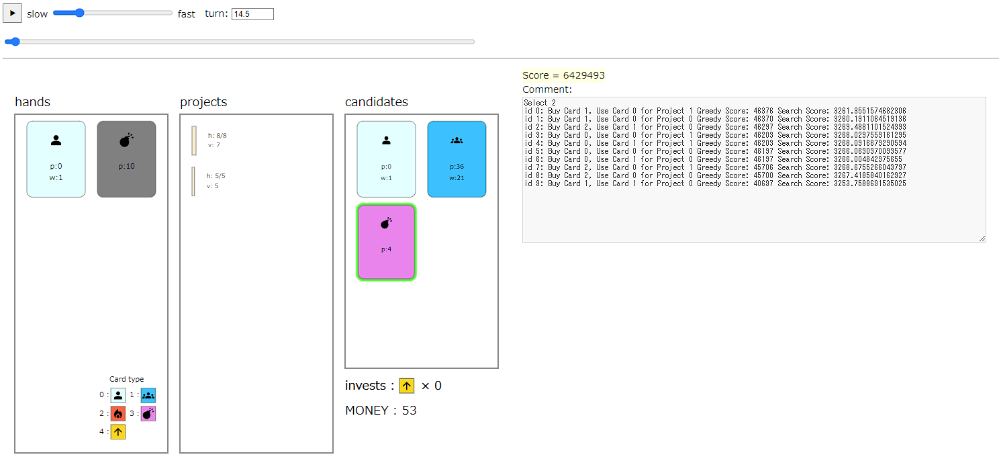
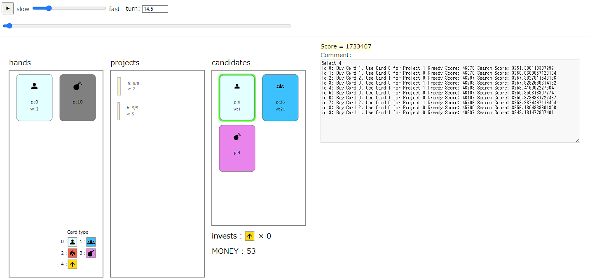

- 選択が割れたのは爆弾の使用有無
- 無難に5を取りに行くのがいいか、資金4消費してガチャを引くか。
  - 確かにこの盤面がつまんないのは事実なんだよね。良いカード引いても資産に出来ない。その状態で5ターンを費やすのが勿体ないのは確か。
  -いやでも今の貪欲だと「単体殴りするのは前に単体殴りしたやつ」みたいな制約があるからその手のムーブ上手く出来ないんだよな。よくない。
- いやそもそも今「こんなもんあってもしゃーないやん！」みたいな資産を大事にし過ぎなのが一番悪いよね、って気がしてきた。
  - 確かにコスパ良いかもしれんけど今そんなん取りにいってもしゃーないやん！みたいなのを評価したい。
  - 足踏みロジックに近いので行けそう。
    - カードの攻撃力と残りHPのバランス
      - なんか仕事する奴なのにいつの間にか敵をカードで殴り倒すゲームに脳内変換してるよね。別に困らないけど。
      - めも：点数が結構違うように見えるので、どういう理由で点数がそんな変わってるのか要調査

```C#
    long GetProjectValue(long V, long HP, int L)
    {
        if (HP <= 0)
        {
            return V * 100L + (100L << L);
        }
        double needValue = 1.0 - 0.25 * HP / V;
        long mul = (long)((V - HP - (2L << L) * 1));
        return (long)(mul * needValue * 100L);
    }
```

- 破壊したらボーナス点、それ以外だと、
  - mulはそのプロジェクトの純粋な価値
  - needValueは必要度。V=HPだと0.75で上下するようにしてる
  - これに「こいつ重すぎるからそんな価値ないぜ」的な要素をいれたい。
    - Vを弄るかneedValueをいじるかどっちか。
    - そもそも価値がないと見るならVかな
      - 攻撃力(金+通常攻撃+全体攻撃)をAとして、min(V, A)とか。
      - もうちょい和らげるなら A + (V - A) * 0.7とか。
      - 通常攻撃を特定のカードに使った時に大きなマイナスが生まれそうなのが難点
    - じゃあneedValueを弄った方がよさげ？
      - A>=HPの時、使える可能性が小さいので無価値扱いしちゃう
        - min(1, A/HP)とかをかける？
          - 割と良さそう。
          - これも通常攻撃使った時にAが下がるから重要度下がるけど、マイナスになるわけじゃないならまぁいいかな。
          - これ採用で
  - ってことで組んでみた。
    - なんか邪魔してそう。
    - min(1, A/HP)をかけてるのがあんまり良くないっぽい
      - Mがでかい時は普通に温存して良い
      - M倍くらいまで許容して良い？
        - M-1倍かなあ。
        - min(1, (A * (M - 1)/HP))にした。
        - よさそう。試す　（Ver126)
          - なんかたまに事故ってる？
```
Score = 11709567 Level = 13 N = 5 M = 2 K = 5 GP = 0 Rate = 1.0000 LastLevelUp = 859 Guess: 1625,1025,995,296,107
``` 

- K=5でこの分布でLevel13はちょっと酷くないか。
  - 何するとこうなるんだろ。
    - M=2だから今回のロジックがめっちゃ悪さしてそうではある。
    - 期待値プラスの時だけ優先度下げしようとしたらマイナスの時だけ下げてました。なんやねんｗ
  - 色々なおして再度提出(Ver127)
    - 思想はかなりいいと思うんだけど、差分評価が全プロジェクトに及んじゃうのを省略してるのが結構マイナスかもしれない
    - -4.1pt。ぬーん。
    - うーん。むずい……。
    - 差分評価で正確に計算するのは難しいし、差分は概算で評価して、貪欲でのランキング上位だけ再計算するか……。(Ver127)
      - ちょこちょこ事故ってるのが見える……！
      - 多分デッドロック的なのがどっかで起きてて身動きを取らないのが正解！みたいになってるんだろうなあ。
      - -6.9pt ひっでえｗ
      - 探索速度が遅いせいなのか、単純に毎回足踏み＋プロジェクト価値再評価が弱いだけなのか。	
        - 足踏み関数の中にこのロジックを入れて、最終形だけこの評価を入れることにした。

